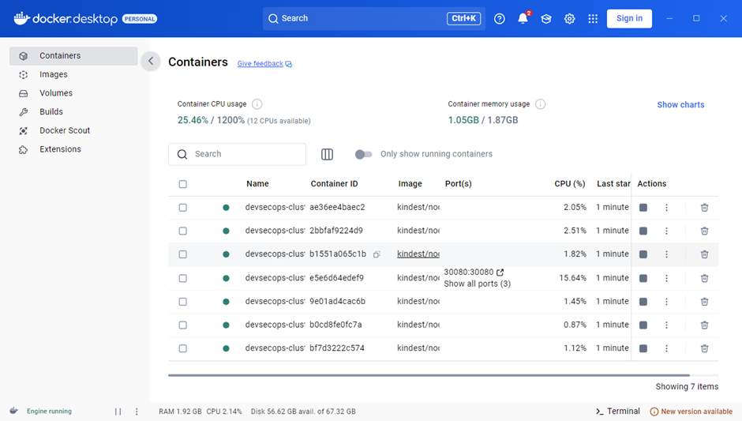

# 2. 사전 준비 사항

## # 2.1  사전 요구 사항 (필요 설치 프로그램)

<table><thead><tr><th width="199" align="center">프로그램</th><th align="center">설명</th></tr></thead><tbody><tr><td align="center">WSL</td><td align="center">Windows에서 Linux 환경을 구축할 수 있게 해주는 핵심 기능을 한다.</td></tr><tr><td align="center">Docker Desktop(kind)<br>kuberctl</td><td align="center">Kind(Kubernetes IN Docker)는 Docker 컨테이너를 사용하여 Kubernetes 클러스터를 쉽게 배포하고 관리할 수 있게 해주는 도구이다.</td></tr><tr><td align="center">Git</td><td align="center">Github 및 Jenkins를 통한 자동화 핵심 기능을 한다.</td></tr><tr><td align="center">Chocolatey</td><td align="center">Chocolatey는 Windows용 패키지 관리자 도구이다.</td></tr><tr><td align="center">localtunnel</td><td align="center">로컬 서버를 인터넷에서 접근 가능한 URL로 노출시켜주는 도구이다.</td></tr></tbody></table>

본 프로젝트의 작업은 Windows 운영체제에서 진행됩니다.

Docker Desktop 설치 후 설정에서 **Enable Kubernetes 해제** 필요 (기본 설정)

<figure><figcaption></figcaption></figure>

## # 2.2 사전 요구 사항 설치

Window PowerShell 관리자 권한으로 실행

### 1) WSL(Windows Subsystem for Linux) 설치

Windows에서 Linux 환경을 구축할 수 있게 해주는 핵심 기능을 한다.

```sh
# WSL 설치
$ dism.exe /online /enable-feature /featurename:Microsoft-Windows-Subsystem-Linux /all /norestart
$ dism.exe /online /enable-feature /featurename:VirtualMachinePlatform /all /norestart

# WSK2 기본 버전으로 설정
$ wsl -set-default-version 2
```

### 2) Chocolatey 설치

Chocolatey는 Windows 용 패키지 관리자 도구이다.

```sh
# Chocolatey 패키지 관리자 설치
$ Set-ExecutionPolicy Bypass -Scope Process -Force
$ [System.Net.ServicePointManager]::SecurityProtocol = [System.Net.ServicePointManager]::SecurityProtocol -bor 3072
$ iex ((New-Object System.Net.WebClient).DownloadString('https://community.chocolatey.org/install.ps1'))
```

### 3) Git 설치

Github 및 Jenkins를 통한 자동화 핵심 기능을 한다.

```bash
# Git 기본 패키지 설치
$ choco install git -y
```

### 4) Docker Desktop, kubectl, kind 설치

Kind(Kubernetes IN Dokcer)는 Docker 컨테이너를 사용하여 kubernetes 클러스터를 쉽게 배포하고 관리할 수 있게 해주는 도구이다.

```bash
# Docker Desktop 설치
$ choco install docker-desktop -y

# kubectl과 kind 설치
$ choco install kubernetes-cli -y
$ choco install kind -y
```

### 5) Localtunnel 설치

로컬 서버를 인터넷에서 접근 가능한 URL 주소로 노출해주는 도구이다.

```bash
# node.js 다운로드
$ http://nodejs.org/ko/

# localtunnel 다운로드
$ npm install -g localtunnel

# Window cmd 관리자 권한 실행
$ lt -subdomain <도메인 이름> --port <사용될 포트>

# 터널 비밀번호
$ http://loca.lt/mytunnelpassword
```
