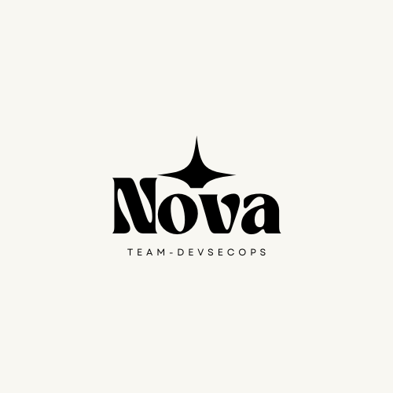

# 서론

**Nova 프로젝트**는 DevSecOps 방식을 통해 개발, 운영, 보안을 효과적으로 통합하여 CI/CD 프로세스를 최적화하고 시스템의 안전성을 강화하는 방법을 제시합니다.&#x20;

<figure><figcaption></figcaption></figure>

특히, Jenkins, SonarQube, Docker, Kubernetes 등을 활용하여 소스 코드 품질을 개선하고 보안 자동화를 구현하는 구체적인 접근법을 제공합니다.

Nova 프로젝트는 다음을 목표로 합니다:

#### 1. 개발성 증대

CI/CD 파이프라인 자동화를 통해 효율적인 빌드 및 배포 프로세스 구현.

#### 2. 보안 내재화

코드 분석 및 취약점 점검 도구를 활용하여 개발 초기 단계에서부터 보안을 강화.

#### 3. 안정적인 환경 구축

kubernetes 기반 확장 가능하고 안정적인 애플리케이션 실행 환경 설계.

#### 4. 협업화 촉진

개발, 운영, 보안 팀 간의 긴밀한 협력을 통해 조직 전반의 보안 인식 제고.

본 가이드는 실무적인 설정 및 적용 사례를 중심으로 DevSecOps 환경을 단계적으로 구축하는 방법을 설명하며, 이를 통해 안전하고 효율적인 소프트웨어 개발, 운영, 그리고 보안을 제공합니다.
